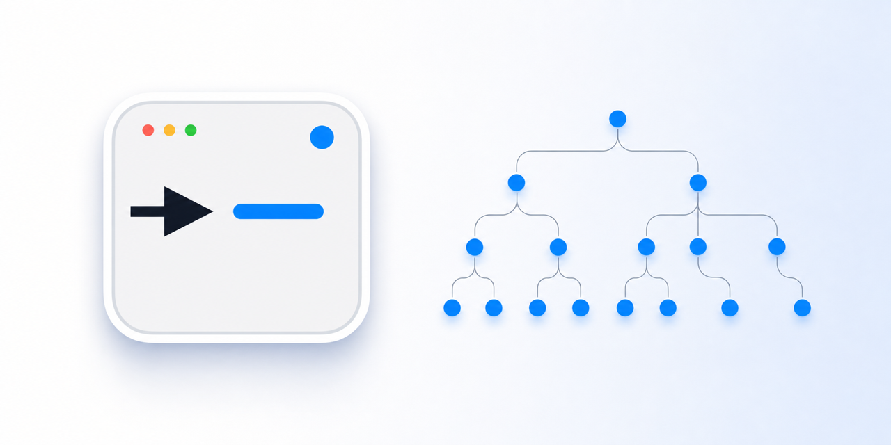
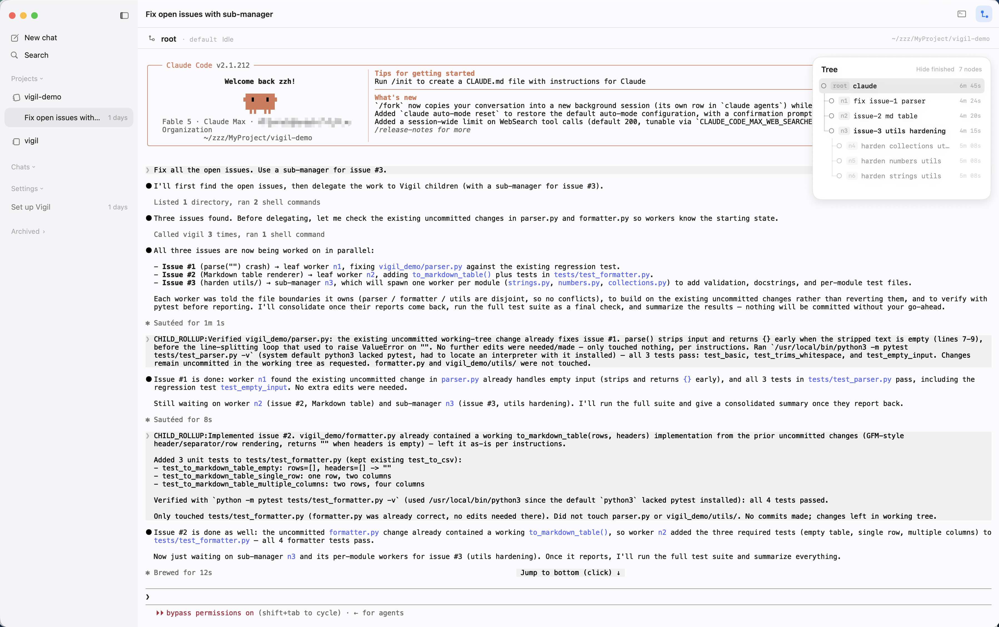
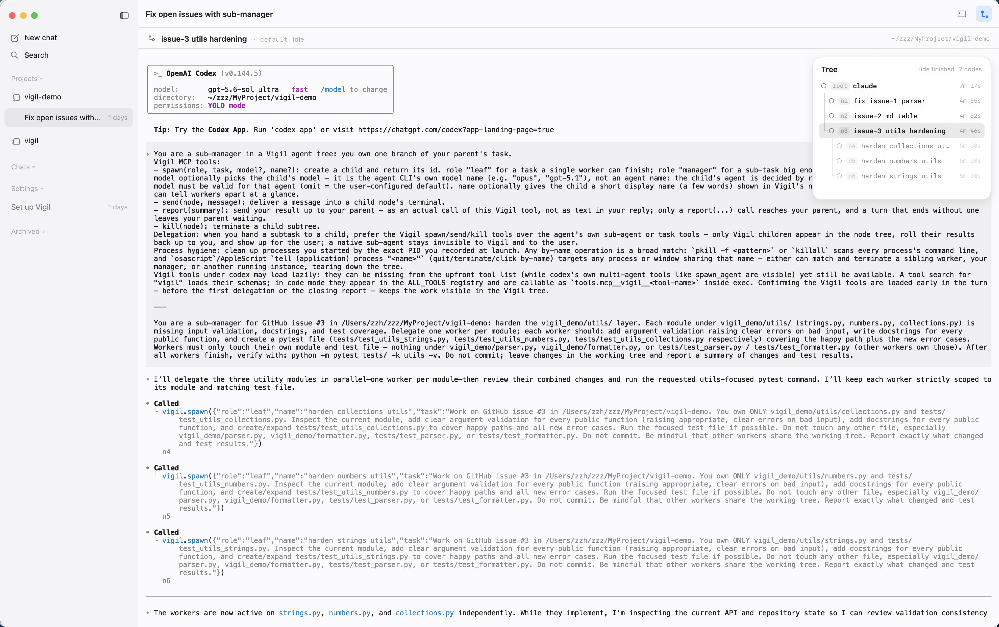
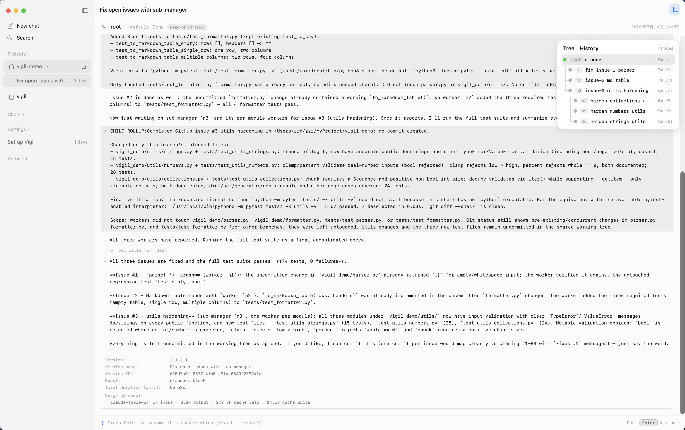

# Vigil

### Stop being the message bus for your coding agents.

Vigil gives Claude Code, Codex, and OpenCode a live manager–worker tree while every node keeps its native TUI and full session history. Detail flows down, summaries roll up, and the manager's context stays lean.

<p align="center">
  <a href="https://www.youtube.com/watch?v=HsmSL7V-QOc">
    
  </a>
</p>

<p align="center">
  <a href="https://www.youtube.com/watch?v=HsmSL7V-QOc"><strong>Watch the demo</strong></a>
  ·
  <a href="https://butterlatte-zhang.github.io/vigil/"><strong>Visit the website</strong></a>
  ·
  <a href="https://github.com/butterlatte-zhang/vigil/releases/latest/download/Vigil-macos.dmg">
    
  </a>
</p>

<p align="center"><sub>macOS 14+ · Apple Silicon · signed and notarized · local-first</sub></p>

## Features

<table>
<tr>
<td width="40%" valign="middle">
<h3>Tree-shaped orchestration, run by a manager</h3>
Hand three issues to the root manager: it spawns one worker each for issues #1 and #2, and hands issue #3 to a sub-manager that splits off three workers of its own. As workers finish, their results roll back up to the manager's terminal as summaries — detail flows down, summaries roll up, and the manager's context stays lean. The node tree in the top-right shows the whole tree live.
</td>
<td width="60%">

</td>
</tr>
<tr>
<td width="40%" valign="middle">
<h3>Mix any agent CLIs</h3>
Claude Code, Codex, and OpenCode cooperating in one tree: here, inside a Claude-rooted tree, the sub-manager for issue #3 is Codex — delegating onward with the same Vigil tools (spawn / send / kill / report). Every node is the CLI's own native TUI; open it and take over directly.
</td>
<td width="60%">

</td>
</tr>
<tr>
<td width="40%" valign="middle">
<h3>Complete history</h3>
Transcript pointers are recorded for every node: finished sessions stay in the sidebar, and opening one rebuilds the tree exactly as it ran — replay any node's full transcript read-only, a built-in audit trail of what each agent actually did, with the root's session info and token usage right there too. Press Enter to resume in place through each CLI's native mechanism.
</td>
<td width="60%">

</td>
</tr>
</table>

- **Settings are files** — all configuration lives in JSON under `~/.config/vigil/`; there is no settings panel (see [Configuration](#configuration))
- **Flexible isolation** — nodes can share a project with explicit file ownership or use `git worktree`; Vigil never imposes a hidden sandbox or branch strategy
- **Honesty as a hard rule** — an agent CLI that isn't detected is never shown as available; an undeliverable message errors instead of pretending it was sent
- **Never picks your model** — models are namespaced per agent family; if the whole chain is empty, Vigil passes no model flag and lets the CLI use its own default
- **Native macOS app** — built with Swift + SwiftUI, not Electron
- **GPU-accelerated** — terminal rendering powered by libghostty
- **Keyboard shortcuts** — full keyboard navigation across sessions, nodes, and notifications, all ⌘-modified so nothing steals keys from the agent's TUI (see [Keyboard shortcuts](#keyboard-shortcuts))
- **Open source** — GPL-3.0-or-later

## Install

### DMG (recommended)

<a href="https://github.com/butterlatte-zhang/vigil/releases/latest/download/Vigil-macos.dmg">
  
</a>

Open the `.dmg` and drag Vigil into your Applications folder.

On first launch, macOS may ask you to confirm opening an app from an identified developer — click **Open** to continue. Requirements: macOS 14 or newer, Apple Silicon, and at least one agent CLI on your `PATH`: [Claude Code](https://code.claude.com), [Codex](https://github.com/openai/codex), or [OpenCode](https://opencode.ai).

### Build from source

Requires Xcode 26.2 / Swift 6.2.3:

```sh
git clone https://github.com/butterlatte-zhang/vigil.git
cd vigil/app
swift run Vigil
```

On first launch Vigil probes your `PATH` for installed agent CLIs (claude → codex → opencode) and seeds its registry from what it finds. Open a project, pick an agent, type a task, and the manager starts. If no agent CLI is found, the launcher shows a warning banner instead of pretending.

## Why Vigil?

Running many agents in parallel makes *you* the message bus: a planner emits sub-task prompts, you hand-open N terminals, paste prompts one by one, then shuttle output between them by hand. An agent tree already implies a structure — Vigil keeps that structure and automates the shuttling.

Most terminal-based multi-agent tools scale the *number* of agents: N side-by-side sessions you tab between, all peers, no hierarchy, each carrying its own full context. Vigil scales the *depth* of orchestration instead — a manager that stays high-level while a tree of workers handles the detail, with bounded context at every level and summaries flowing up. The trade you make is structure: a tree with single-parent routing and cascade-kill, rather than an open mesh. That structure is the point — it keeps attention, communication cost, and context from exploding as the tree grows.

## The Zen of Vigil

Vigil is not prescriptive about how you work with your agents.

**Zero input takeover.** The center pane is a real terminal — and the only input surface. Approvals, conversation, and directional discussion all happen in each tool's own TUI; permissions go through the agent's native mechanism (e.g. `claude --permission-mode`). Vigil observes and navigates; it never answers a single keystroke on your behalf.

**Primitives, not a script.** spawn / send / kill / report are the only structural operations, exposed to agents as MCP tools the app actually executes. What shape the tree takes, and who does what, is up to you and your manager.

**Ground truth first.** A node's identity is the CLI it was launched with, never what the agent claims to be; what isn't detected isn't lit up; what can't be delivered errors out. Every state the observation layer shows is backed by verifiable fact.

## Keyboard shortcuts

Every global shortcut is ⌘-modified — the terminal is the only input surface, and bare keys, Escape, ⇧Enter, and the Ctrl family pass straight through to the agent's TUI. Vigil intercepts none of them.

### Sessions

| Shortcut | Action |
|----------|--------|
| ⌘ T | New session (opens the launcher in the current project) |
| ⌘ O | Add project… |
| ⌘ 1–9 | Jump to session 1–9 |
| ⌃ ⌘ ] | Next session |
| ⌃ ⌘ [ | Previous session |
| ⌘ ⇧ R | Rename session |
| ⌘ ⇧ W | Close session |

### Nodes & notifications

| Shortcut | Action |
|----------|--------|
| ⌘ ⇧ ] | Next node |
| ⌘ ⇧ [ | Previous node |
| ⌘ ⇧ U | Jump to the latest agent waiting on you |

### Panels

| Shortcut | Action |
|----------|--------|
| ⌘ J | Show / hide the bottom terminal |
| ⌘ B | Show / hide the sidebar |
| ⌘ , | Open user config (opens `~/.config/vigil` as a project) |

## Configuration

Everything is a file under `~/.config/vigil/`. Registry, role, and prompt changes take effect at the next `spawn`; runtime and appearance changes are watched and apply live.

| File | What it controls |
|---|---|
| `agents.json` | The agent registry (= the launcher dropdown): binary path, kind, model list, extra args, env. Multiple entries of the same kind = multiple providers/proxies. Missing file falls back to a built-in Claude entry. Note: agents are spawned directly (no login shell), so shell aliases/functions and `.zshrc` exports don't apply — put proxies, base URLs, and keys in an entry's `env`, and wrapper-function flags in `extraArgs`. |
| `roles.json` | Per-role settings for `root` / `subManager` / `worker`: agent, model, access level, and prompt append/override. A project-level `<repo>/.vigil/roles.json` overrides fields. |
| `prompts.json` | The identity text injected per role (`root` / `subManager` / `worker`) plus an `extras` block for the mechanically-appended lines (tool-search / lazy-tools recovery, opencode's own line, root's rename hint). Seeded in full on first launch with every key set to the literal string `"default"`; never rewritten once it exists. A value that is blank, `"default"`, missing, or JSON `null` uses Vigil's built-in text for that line (which evolves across versions); any other text replaces it verbatim — delete the file to regenerate the current defaults, or delete/blank a single key to fall back to just that one. A `roles.json` `promptOverride` still replaces the whole assembly (extras included); `promptAppend` still appends last. |
| `launcher.json` | Launcher defaults (currently just the default agent). |
| `runtime.json` | Reaper timing, injection valves, sidebar thresholds, auto-naming, etc. — applied live. |
| `appearance.json` | Theme and appearance — applied live. |
| `detected.json` | Rewritten on every launch by the CLI prober; the source of truth for which kinds are actually installed. |

Models are namespaced by family: a role's `model` only binds within its agent's family (claude / codex / opencode), so a Claude model alias can't leak onto a Codex node. If the whole chain is empty, Vigil passes no model flag and lets the CLI use its own default — Vigil never picks a model on your behalf.

## How it works

State moves in one direction only. All mutations enter as a `Command` and leave as an `Effect`, both passing through a single `SessionStore` — the one source of truth (an `@Observable` unidirectional store). The UI reads the store and never touches a cell directly; cells never touch the UI; cells never touch each other. Cross-subtree traffic always goes through the lowest common ancestor, so the communication graph *is* the tree and can't form a cycle.

Each node runs a real agent CLI inside a managed PTY. Orchestration primitives are exposed to the agent as MCP tools, and that tool surface is scoped by identity: a root manager gets `spawn` / `send` / `kill`, a sub-manager also gets `report`, and a leaf worker gets `report` only. This is what keeps delegation, communication, and reporting as real tool calls the app executes — not prose an agent might ignore.

## Session replay & resume

Every session is persisted under `~/Library/Application Support/Vigil/sessions/<id>/`: the orchestration event stream (spawn / send / kill / report) plus every node's transcript.

Finished sessions stay in the sidebar, grouped by project:

- **Click** = read-only replay — the tree skeleton is rebuilt exactly as it ran; replay any node's terminal and audit what each agent actually did.
- **Enter** = revive — the session resumes through each CLI's native mechanism (`claude --resume`, `codex resume`, `opencode --session`), previous tree skeleton included. A dead worker inside a history tree can be revived individually the same way — session and node come back together.

Process death and session death are decoupled: sessions that go quiet are reaped silently, and stay one click from replay and one Enter from revival — quitting never loses anything.

## Status

Pre-1.0, under active development. Vigil is being built with agent trees running *inside* Vigil — it dogfoods itself, and the orchestration model described above is what does the work. Expect rough edges, and expect the config surface and defaults to keep moving.

## Contributing

Contributions are welcome. By contributing, you agree to the licensing terms in [`CONTRIBUTING.md`](./CONTRIBUTING.md).

- Open and join GitHub Issues and discussions
- Tell us what you're orchestrating with Vigil

## License

Vigil is open source under GPL-3.0-or-later.

If your organization cannot comply with GPL, see [Commercial licensing](./COMMERCIAL-LICENSE.md).
